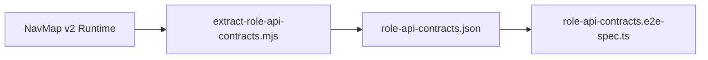

# Role API Contracts (J1)

Deterministic API contract tests derived from NavMap v2 runtime files.

## Overview

This suite validates RBAC enforcement at the API layer by:
- **401 tests**: Protected endpoints reject requests without authentication token
- **2xx tests**: Allowed endpoints return success for the correct role
- **403 tests**: Lower-privilege roles are denied access to higher-privilege endpoints

## How Contracts Are Generated



### Source Files

Runtime JSON files from NavMap v2 navigation testing:
- `reports/navigation/runtime/cashier.runtime.json`
- `reports/navigation/runtime/waiter.runtime.json`
- `reports/navigation/runtime/chef.runtime.json`
- `reports/navigation/runtime/bartender.runtime.json`
- `reports/navigation/runtime/supervisor.runtime.json`
- `reports/navigation/runtime/manager.runtime.json`
- `reports/navigation/runtime/accountant.runtime.json`

### Extraction Script

```bash
node scripts/analysis/extract-role-api-contracts.mjs
```

Output: `reports/contracts/role-api-contracts.json`

## Role Coverage

| Role | Level | Endpoints | Source |
|------|-------|-----------|--------|
| CASHIER | L2 | 8 | routesVisited fallback |
| WAITER | L1 | 4 | apiCallsByRoute |
| CHEF | L2 | 1 | apiCallsByRoute |
| BARTENDER | L1 | 3 | apiCallsByRoute |
| SUPERVISOR | L2 | 16 | apiCalls |
| MANAGER | L4 | 20 | apiCalls (capped from 31) |
| ACCOUNTANT | L4 | 14 | apiCalls |

## Test Structure

### A) Auth Baseline (401 without token)

Tests that protected endpoints require authentication:
- `GET /dashboard` → 401
- `GET /pos/menu` → 401
- `GET /pos/open` → 401

### B) Role Allowed Endpoints (2xx for correct role)

For each of the 7 roles, tests that their allowed GET endpoints return success (200, 201, 204).

> **Note**: Only GET endpoints are tested in J1 to avoid side effects. POST/PUT/PATCH coverage planned for J2.

### C) Negative RBAC (403 for wrong role)

Tests that lower-privilege roles cannot access higher-privilege endpoints:
- L1 roles (WAITER, BARTENDER) cannot access `/analytics/daily`, `/analytics/branches`, `/accounting/accounts`
- L2 roles (CASHIER) cannot access L4 endpoints

### D) Cross-Role Verification

Spot-checks that specific roles have access to their domain endpoints:
- MANAGER → `/analytics/daily`
- ACCOUNTANT → `/accounting/accounts`
- CHEF → `/kds/tickets`
- SUPERVISOR → `/workforce/swaps`

## Running Tests

```bash
# Full E2E suite (includes contract tests)
pnpm -C services/api test:e2e:strict

# Run only contract tests
pnpm -C services/api jest --testPathPattern=role-api-contracts
```

## Extending Coverage

### Adding New Roles

1. Create NavMap runtime file: `reports/navigation/runtime/{role}.runtime.json`
2. Re-run extraction: `node scripts/analysis/extract-role-api-contracts.mjs`
3. Add role to `ROLE_CREDENTIAL_MAP` in test file
4. Ensure role exists in `TAPAS_CREDENTIALS` (e2e-credentials.ts)

### Adding POST/PUT Tests (J2)

Phase J2 will extend coverage to mutating endpoints:
- POST tests with idempotent payloads
- PUT tests with update payloads
- PATCH tests for partial updates

## Files

| File | Purpose |
|------|---------|
| `scripts/analysis/extract-role-api-contracts.mjs` | Extracts contracts from runtime JSONs |
| `reports/contracts/role-api-contracts.json` | Unified contract output |
| `services/api/test/e2e/role-api-contracts.e2e-spec.ts` | E2E contract test suite |
| `docs/contracts/ROLE_API_CONTRACTS.md` | This documentation |

## Related

- [NavMap v2 Runtime Format](../navigation/NAVMAP_V2.md)
- [RBAC Design](../security/RBAC.md)
- [E2E Test Credentials](../../services/api/test/helpers/e2e-credentials.ts)
